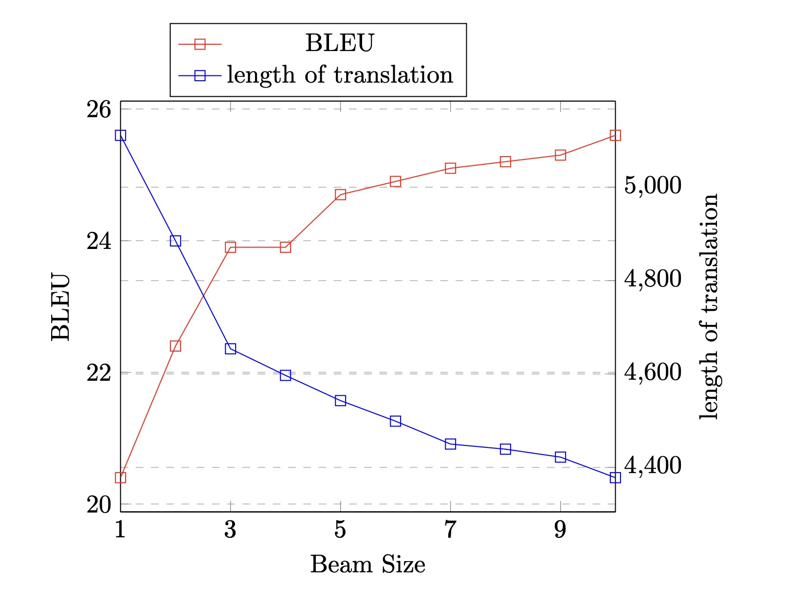

# Assignment 4: Improving Beam Search

## Data and Model
In this assignment we use fr-en data from the Tatoeba
corpus (same as in assignment 3).

We use `assignments/03/lexical_batch_batch2/checkpoints/checkpoint_best.pt` as checkpoint for the model.
## 1. Experimenting with Beam Search
The translation results are stored in assignment/04/beam_search.

The beam search result are in the below picture:

As shwon above, we tried beam size from 1 to 10, and  we choose to plot the length of translation instead of the brevity penalty because the brevity penalty for all of them is always 1,

Why brevity penalty is always 1? Let r be the length of the reference in words, and t length of the translation. Brevity Penalty is computed as BP=exp(1-r/t),if ratio=(r/t)>=1. Otherwise (i.e. if ratio < 1), BP=1. In our case, translation is always longer than reference (which is 3892), so the ratio is less than 1, and brevity penalty is 1.

Using larger beam size increases decoding time, as there are more hypotheses to be tracked.

We can see that increasing beam size always increases BLEU score in our case. Maybe this is because the lexical model we use creates longer sentences, and thus not being punished by brevity penalty, so searching in a larger range of hypothesese is always better than a smaller range. (But we are not fully sure about it, since in the lecture it is said too large beam size will decrease BLEU score. Maybe here beam size of 10 is still not big enough.)

