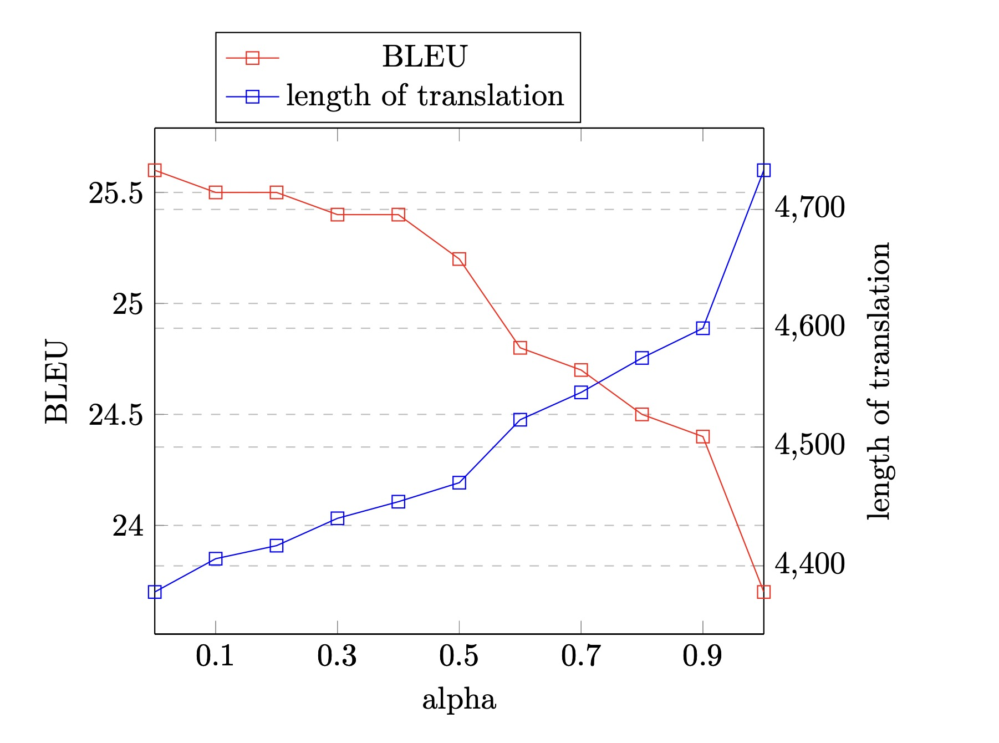

# Assignment 4: Improving Beam Search
Yifei Liu, Kexin Shi

Date: Dec 6, 2021

The repository link is [https://github.com/kaikai23/atmt/](https://github.com/kaikai23/atmt/)

The report link is [https://github.com/kaikai23/atmt/blob/master/assignments/04/README.md](https://github.com/kaikai23/atmt/blob/master/assignments/04/README.md)
## Data and Model
In this assignment we use fr-en data from the Tatoeba
corpus (same as in assignment 3).

We use `assignments/03/lexical_batch_batch2/checkpoints/checkpoint_best.pt` as checkpoint for the lexical model, which is the best model from our assignment 03.
## 1. Experimenting with Beam Search
The translation and postprocessed translation results are stored in assignment/04/beam_search. 
Use `cat assignments/04/beam_search/k\=?/translations.p.txt | sacrebleu data/en-fr/raw/test.en` to check the BLEU score and brevity penalty for different beam sizes, and you should replace the ? with a number between 1 to 10.

The beam search results are ploted in the below picture:

As shwon above, we tried beam size from 1 to 10, and  we choose to plot the length of translation instead of the brevity penalty because the brevity penalty for all of them is always 1, the best BLEU score is 25.6.

**1.1. Why brevity penalty is always 1?**

Let r be the length of the reference in words, and t length of the translation. Brevity Penalty is computed as BP=exp(1-r/t),if ratio=(r/t)>=1. Otherwise (i.e. if ratio < 1), BP=1. In our case, translation is always longer than reference (which is 3892), so the ratio is less than 1, and brevity penalty is 1.

**1.2. What is the relationship between beam size and decoding time?**

Although we didn't record the time explicitly, we had an obvious feeling that when beam size is small, the translation happens in a blink of en eye, while it takes  several seconds when beam size gets larger and larger. So larger beam size increases the decoding time, which is reasonable as there are more hypotheses to be tracked and explored.

**1.3. Why translation length decreases as the beam size increases?**

At each time step the hypothesis would be multiplied with a fractional number of possibility of the current predicted words, so longer hypothesis tends to have smaller overall possibility, which causes the fact that we can often find shorter hypothesese with higher overall possibilities if we expand our searching area. 

**1.4. Why BLEU keeps increasing with beam size in our experiment?**

We can see that increasing beam size always increases BLEU score in our case. Maybe this is because the lexical model we use tend to create longer sentences than reference, and thus not being punished by brevity penalty. Therefore searching among a large range of candidates is always better than a smaller amount of candidates since the latter is included in the former. 

However, in the lecture it is said that too large beam size will decrease BLEU score. This does not contradict our observations, because we believe if we continue increasing the beam size such that when translation length becomes shoter than reference, the shoter translation will be punished by brevity penalty and then BLEU score will begin to decrease.

## 2. Understanding the Code
**QUESTION 1: What is "go_slice" used for and what do its dimensions represent?**

At the first time step there is no previous predicted words, so go_slice which is a [500,1] tensor filled with EOS is used to feed to the decoder, where 500 represents the batch size.

**QUESTION 2: Why do we keep one top candidate more than the beam size?**

If the current best candidate is UNK, then we switch to next best candidate. So there needs to be one more candicate.

**QUESTION 3: Why do we add the node with a negative score?**

The node are defined in BeamSearch class in beam.py by `self.node = PriorityQueue()`, which is defined in queue.py retrieving entries with lowest values first. So adding a negative in front of the score can make the largest ones become lowest, hence with highest priority.

**QUESTION 4: How are "add" and "add_final" different? What would happen if we did not make this distinction?**

add_final is used for EOS word and stops adding the log probability and length(`node.logp, node.length` instead of `node.logp + log_p, node.length + 1`). And add_final adds the node to search.final, which is a different PriorityQueue from search.nodes, so the beam doesn't expand on that node anymore.

**QUESTION 5: What happens internally when we prune our beams? How do we know we always maintain the best sequences?**

The prune function is defined as a method of class BeamSearch in beam.py. First we initialize a new PriorityQueue and put the k best nodes in the queue. Then we replace self.nodes with the new nodes and thus maintaining the best sequences, because the PriorityQueue returns lowest values first which are actually highest scores of sequences.

**QUESTION 6: What is the purpose of this for loop?**

This for loop converts the padded token sequences back to valid token sequences. It finds the index where the token is an EOS and add the sequence up to this index to a temp list. If there is no EOS in a sequence, it adds the complete 100 tokens in this sequence to the temp list. And then the temp list is converted to real words using the target dictionary.

## 3. Adding Length Normalization

We choose 10 values of alpha between 0 and 1. Again, the brevity penalty of all expetiments are exactly 1, since length of translation is always larger than length of refernce (3892). The results are as follows:

The optical alpha is 0, so we don't need to run experiments to search best hyperparameters combinations for alpha and beam size. The best combination is just the figure in Section 1: beam size=10, alpha=0, BLEU=25.6.

We can see that as the alpha increases, the BLEU score keeps decreasing and length of translation keeps increasing. It is no wonder to see this, because in our case the decoding is never punished by brevity penalty. When alpha is 0, everything is fine. When alpha increases or even becomes 1, we have a length normalization effect such that longer sentences are prefered, so length of translation increases as alpha increases. However, this drops the BLEU score since there is no point in preferring a longer translation which tends to have a smaller overall possibility (we have explained this in 1.3), if we are not punished by brevity penalty.

Conclusion from our experiment: length normalization does not take effect when brevity penalty is already 1. However, from the paper [1] it is said length normalization is very useful. Our guess is that it is useful when translations are too short and are being punished by brevity penalty, and this is where length normalization plays its role: it makes the decoding prefer longer sentences, thus being less punished by brevity penalty.

## 4. Investigating the Diversity of Beam Search

## Reference
[1]Yonghui Wu, Mike Schuster, Zhifeng Chen, Quoc V. Le, Mohammad Norouzi, Wolfgang
Macherey, Maxim Krikun, Yuan Cao, Qin Gao, Klaus Macherey, Jeff Klingner, Apurva Shah,
Melvin Johnson, Xiaobing Liu, Lukasz Kaiser, Stephan Gouws, Yoshikiyo Kato, Taku Kudo,
Hideto Kazawa, Keith Stevens, George Kurian, Nishant Patil, Wei Wang, Cliff Young, Jason
Smith, Jason Riesa, Alex Rudnick, Oriol Vinyals, Gregory S. Corrado, Macduff Hughes, and 
Jeffrey Dean. Google’s neural machine translation system: Bridging the gap between human
and machine translation. CoRR, abs/1609.08144, 2016.
